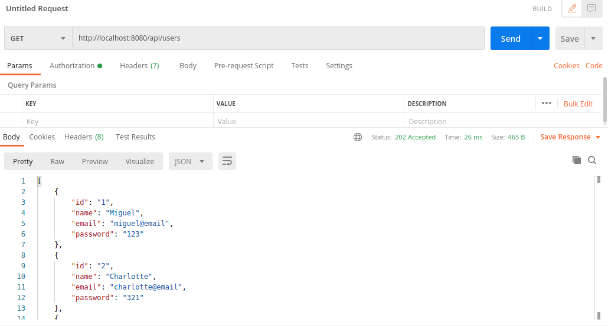

# 2.1 Task Planner API

## Author

- Miguel Ángel Rivera Rojas

## Running instructions

- Install Java JDK version 11
- Install gradle
- Type the following command in the commandPrompt ``$git clone https://github.com/migue1994/IETI-lab-06-back.git``
- Get in into the root aplication folder
- Enter the command ``$gradle bootRun``
- Test the api with postman or other ways

## Application test

## Docker's image azure deployment

- http://taskplanner-backend.westcentralus.azurecontainer.io:8080/api/users

## Link to front repository

- https://dev.azure.com/miguelrivera-r/_git/Lab-06

## Front-end deployment

- https://ieti-lab06-front.azurewebsites.net/

## Honor Code

La presencia de este documento en este repositorio es un compromiso explícito de los colaboradores de seguir el siguiente código de honor:

Código de Honor
------
Debes seguir el Código de honor del ingeniero de sistemas para defender el estándar de integridad académica de la ECI:

- Tus respuestas a tareas, cuestionarios y exámenes deben ser tu propio trabajo (excepto para las tareas que permiten explícitamente la colaboración).

- No puedes compartir tus soluciones de tareas, cuestionarios o exámenes con otra persona a menos que el instructor lo permita explícitamente. Esto incluye cualquier cosa escrita por ti, como también cualquier solución oficial proporcionada por el docente o el monitor del curso.

- No puedes participar en otras actividades que mejorarán de manera deshonesta tus resultados o que mejorarán de manera deshonesta o dañarán los resultados de otras personas.
